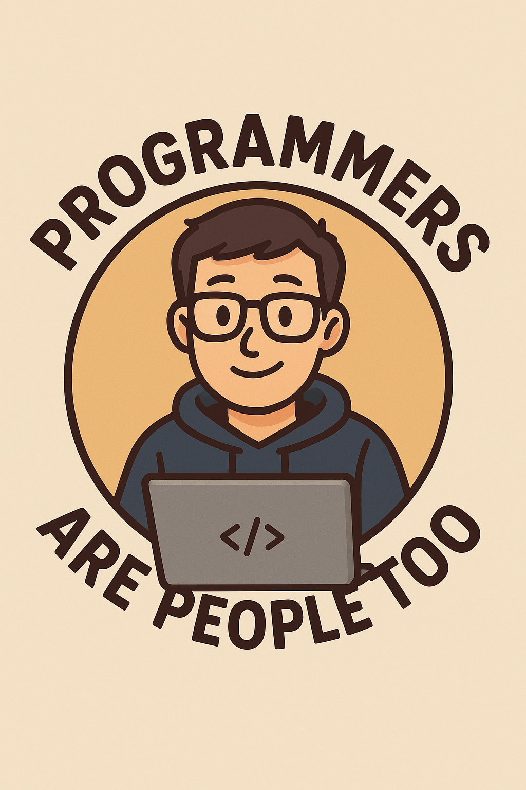

# Programmers Are People Too ✨



*Improving the programming experience by giving Positive feedback (Applaus on successes) in a addition to the prevalent negative Feedback (Error Highlighting).* 

> Like good teachers who use green pens to highlight excellent work alongside red pens for corrections, we want development tools that celebrate achievements, not just point out problems.


## Introduction
### The Problem 🚨

Software developing often feels like in the courtroom:
- **Red underlines** screaming about errors
- **Yellow warnings** nagging about potential issues  
- **Angry compiler messages** judging our every keystroke

This makes programming feel tedious and draining.


### The Solution 

We move the programming experience from in the dock like to be 'on stage' with an enthusiastic audience.

- **Applaus and Fireworks** on success.
- **Visual Feedback** on inspecting.

Programming becomes rocking the crowds ツ

## Conceptual Overview
### Positive Feedback Types
- **Sparkles** when your linter or prettier goes silent (errors → clean code)
- **Smooth pulse** animations on successful builds
- **Confetti** in the terminal after clean CI runs
- **Green highlights** when syntax errors disappear (red → normal)

### Event Selection
- **Predefined Events** fixing errors or successful builds and runs
- **AI-powered appreciation** for especially clever or clean code snippets


## What We're Building 🛠️

We build tools to provide positive feedback during programming. 


[to be extented]

### VS Code Extension (`code/vscode/`)
- Hooks into the Language Server Protocol (LSP) for real-time feedback
- Monitors diagnostic changes and celebrates improvements
- Integrates with build tasks, formatters, and linters
- Beautiful visual feedback for coding achievements

### Neovim Plugin (`code/nvim/`) *[Planned]*
- Cross-platform positive reinforcement
- Vim-native celebration mechanics
- Shared core logic with VS Code extension

### Future Possibilities 🚀
- **AI-powered code appreciation** using MCP servers
- **CLI tools** for terminal-based celebrations
- **Integration with popular tools** (Jest, ESLint, Prettier, etc.)
- **Team celebration modes** for collaborative wins

## Quick Start 🎬

### Development Setup
```bash
# Clone and navigate
git clone https://github.com/Oliver122/programmers-are-people-too.git
cd programmers-are-people-too

# VS Code Extension Development
cd code/vscode
npm install
npm run watch  # Start TypeScript compiler in watch mode

# Press F5 to launch extension in new VS Code window
```

### Project Structure
```
├── code/
│   ├── vscode/          # VS Code extension source
│   └── nvim/            # Neovim plugin (planned)
├── documentation/       # Project docs
├── assets/             # Media and presentations
└── .github/            # AI agent instructions
```

## Contributing 🤝

We believe **developers deserve positive feedback**. Join us in changing how development tools make us feel.

### Core Principles
1. **Celebrate achievements**, don't just highlight problems
2. **Visual feedback** should feel delightful, not intrusive  
3. **Multi-editor support** - positive vibes for everyone
4. **Real-time responsiveness** - celebrate the moment it happens

## License 📄

MIT License - Spread the positive vibes! 🎉

---

*Built with ❤️ for BaselHack 2025*  
*Because programmers are people too, and people deserve to feel good about their work.*
